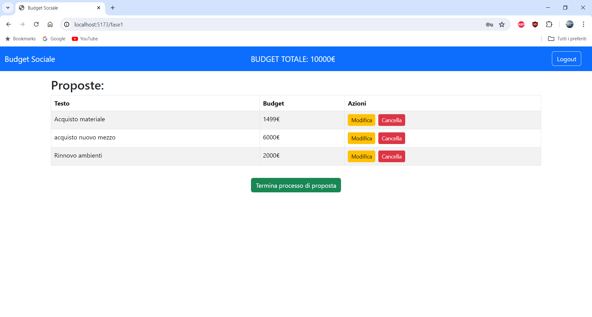
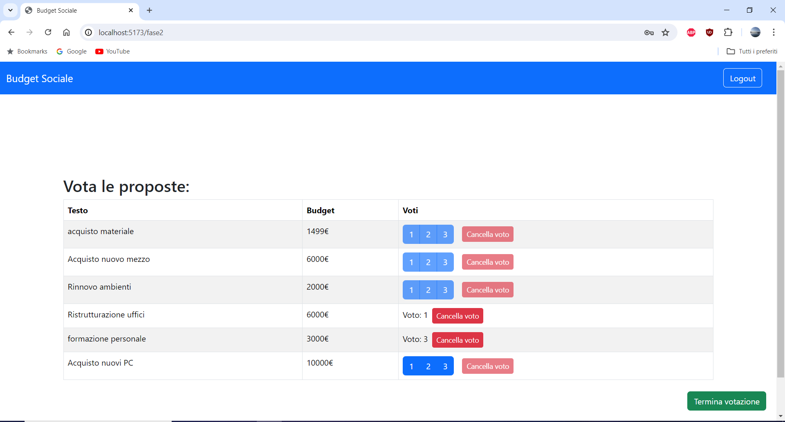

# Exam #2: "Budget sociale"
## Student: s334034 MESSETTI EMANUEL 

## React Client Application Routes

- Route `/`: route che va direttamente a reindirizzare alla fase corrente
- Route `/fase0`: pagina di definizione del budget
- Route `/fase1`: pagina di inserimento delle proposte
- Route `/fase2`: pagina per la votazione delle proposte
- Route `/fase3`: pagina che mostra le proposte approvate e non
- Route `/login`: pagina che porta al form di log in
- Route `/*`: pagina che comprende tutte le route che non hanno a che fare con l' applicazione

## API Server

- GET `/api/proposte` e `/api/proposte/best`
  - response body content:
  `[
  {
    "id": 1,
    "text": "Nuovo mezzo aziendale",
    "budget": 6000,
    "userID": 0,
    "rating": 0
  },
  {
    "id": 2,
    "text": "formazione personale",
    "budget": 3000,
    "userID": 0,
    "rating": 3
  },
  {
    "id": 3,
    "text": "acquisto materiale",
    "budget": 1499,
    "userID": 1,
    "rating": 7
  }
]`

- POST `/api/proposte` e PUT `/api/proposte`
  - request body content:
  `{
    "id": 0,
    "text": "formazione personale",
    "budget": 3000,
    "userID": 0,
    "rating": 3
  }`
  
- DELETE `/api/proposte/:id`
  - Request parameters: id di una proposta
  
- DELETE `/api/proposte`
  - Elimina tutte le proposte

- PUT `/api/proposte/:id/vote` e PUT `/api/proposte/:id/revoke-vote`
  - Request parameters: id di una proposta
  - request body content:
  `{
    "id": 0,
    "voto": 3
  }`

- PUT `/api/fase`
  - Request body content:
  `{
    "fase": 2
  }`

- GET `/api/fase`
  - Response body content:
  `{
    "fase": 2
  }`

- PUT `/api/budget`
  - Request body content:
  `{
    "budget": 1000
  }`

- GET `/api/budget`
  - Response body content:
  `{
    "budget": 1000
  }`

- GET `/api/voti`
  - response body content:
  `[
  {
    "propostaid": 1,
    "userid": 0,
    "voto": 1
  },
  {
    "propostaid": 1,
    "userid": 3,
    "voto": 2
  },
  {
    "propostaid": 2,
    "userid": 0,
    "voto": 3
  }
]`

- POST `/api/voti` e DELETE `/api/voti`
  - request body content:
  `{
    "propostaid": 2,
    "userid": 0,
    "voto": 3
  }`

- DELETE `/api/voti/all`
  - Elimina tutti i voti

- GET `/api/utenti`
  - response body content:
  `[
  {
    "id": 0,
    "username": "admin",
  },
  {
    "id": 1,
    "username": "user1",
  },
  {
    "id": 2,
    "username": "user2",
  },
  {
    "id": 3,
    "username": "user3",
  }
]`

- GET `/api/session/current`
  - Response body content:
  `{
    "id": 3,
    "username": "user3",
  }`

- DELETE `/api/session/current`

## Database Tables

- Table `users` - contains ID, username, salt, password, role
- Table `proposte` - contains ID, text, budget, userID, rating
- Table `dati` - contains ID, fase, budget
- Table `voti` - contains PropostaID, UserID, voto

## Main React Components

- `Fase0` (in `Fase0.jsx`): componente che mostra un form per l' admin dove poter definire il budget
o un messaggio all' utente che il budget è da definire
- `Fase1` (in `Fase1.jsx`): contiene un form per utenti registrati e una tabella dove eventualmente verranno
salvate le proposte dell' utente
- `Fase2` (in `Fase2.jsx`): contiene una tabella con tutte le proposte degli utenti, ogni proposta può essere
votata con un voto da 1 a 3.
- `Fase3` (in `Fase3.jsx`): contiene la tabella delle migliori proposte scelte in base alla votazione e al budget,
più la tabella delle risposte scartate.

## Screenshot

## Users Credentials

- admin, admin (utente con privilegi da admin)
- user1, user1 (utente registrato)
- user2, user2 (utente registrato)
- user3, user3 (utente registrato)
